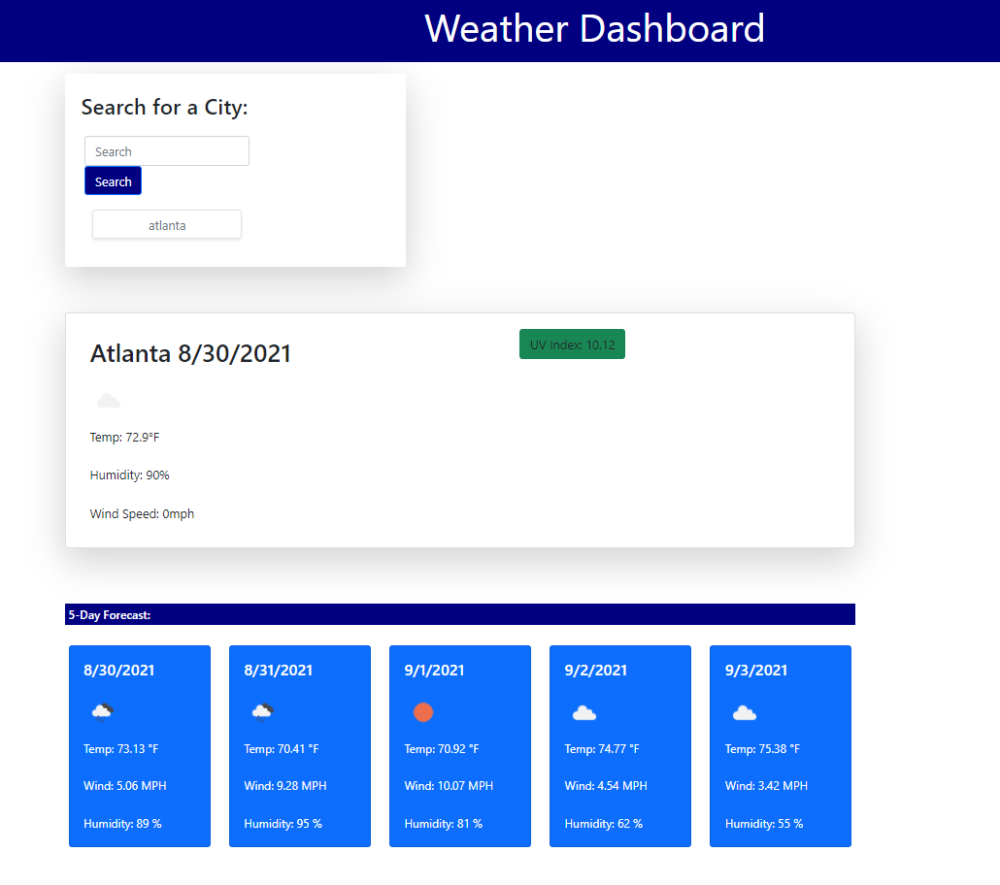

# Weather-Dashboard

Project By: Taylor Bowen 
GitHub Profile:  <https://github.com/tbowenmsu> 
Project GitHub Repository: <https://github.com/tbowenmsu/Weather-Dashboard>  
Project URL: <https://tbowenmsu.github.io/Weather-Dashboard/> 

## Project Description
This page allows a traveler to look at the local weather for a chosen city. They can use the search bar to search for a certain city. They will be presented with the current weather and also, below that, a five day outlook forecast.
Their recent searches are saved in local storage and are easily able to be clicked under the search bar to pull that cities weather back up.

## Screenshot of Deployed Application

## Project Elements: 

1. A search area allowing the user to search by location.

2. A search history allowing the user to quickly pull up weather data from recently searched cities.

3. A large card showing weather data for the current day including temperature in farenheit, UV index, wind speed, and humidity.

4. Five smaller cards showing weather outlook for the next 5 days.

5. Icons to better show weather conditions.

## Citations: 
Moment <https://momentjs.com/> 
jQuery <https://jquery.com/> 
openweathermap API <https://openweathermap.org/api> 
Bootstrap <https://getbootstrap.com/> 

## License: 
Copyright (c) 2021 Taylor Bowen
Licensed under the [MIT LICENSE](LICENSE)